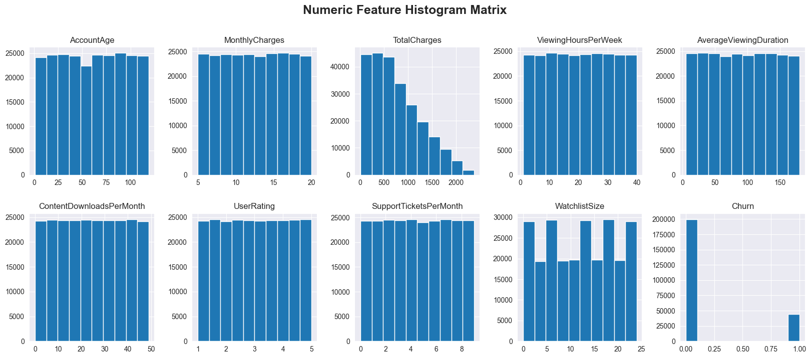
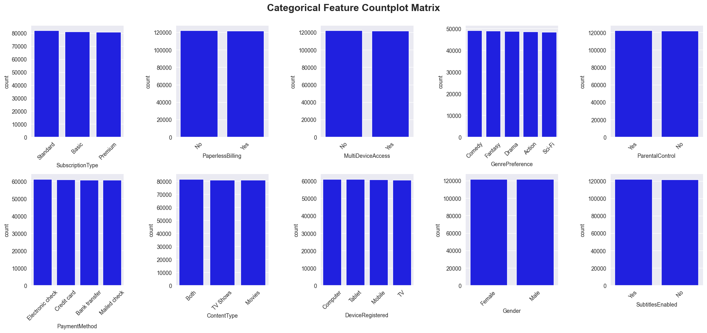
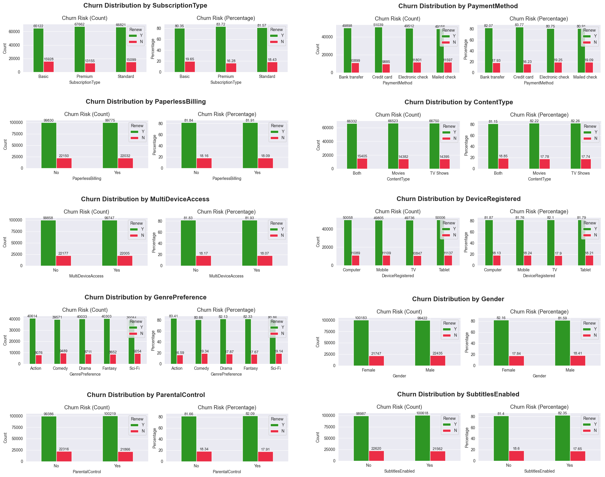
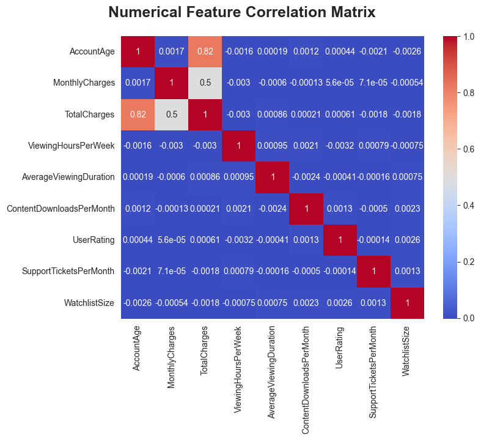

##### Thursday the 25th of July, 2024
# Predicting Churn Risk in Customers of a Video Streaming Service*

## Introduction
### Background

Subscription services are leveraged by companies across many industries, from fitness to video streaming to retail. One of the primary objectives of companies with subscription services is to decrease churn and ensure that users are retained as subscribers as it is more costly to procure new customers than to retain exsisting ones. 

Subscription cancellation can happen for a multitude of reasons, including:
* the customer completes all content they were interested in, and no longer need the subscription
* the customer finds themselves to be too busy and cancels their subscription until a later time
* the customer determines that the streaming service is not the best fit for them, so they cancel and look for something better suited

Regardless the reason for cancelling a subscription, this video streaming company has a vested interest in understanding the likelihood of each individual customer to churn in their subscription so that resources can be allocated appropriately to support customers. In order to do this efficiently and systematically, companies employ machine learning to predict which users are at the highest risk of churn.

### Objective

 The goal of this project is to develop a reliable machine learning model that can predict which existing subscribers will continue their subscriptions for another month, so that proper interventions can be effectively deployed to the right audience. In other words, using the patterns found in the `train.csv` data, we will predict whether the subscriptions in `test.csv` will be continued for another month, or not.

## Dataset description
The dataset used in this project is a sample of subscriptions initiated in 2021, all snapshotted at a particular date before the subscription was cancelled. The data is split 70/30 into a training set and a test set, which contain 243,787 and 104,480 entries, respectively.

Both `train.csv` and `test.csv` contain one row per unique subscription. For each subscription, a (`CustomerID`) identifier column is included. In addition to this identifier column, the `train.csv` dataset also contains the target variable, a binary column `Churn`.

Both datasets have an identical set of features. Descriptions of each feature are shown below.

<table border="1" class="dataframe">
  <thead>
    <tr style="text-align: right;">
      <th></th>
      <th>Column_name</th>
      <th>Column_type</th>
      <th>Data_type</th>
      <th>Description</th>
    </tr>
  </thead>
  <tbody>
    <tr>
      <th>0</th>
      <td>AccountAge</td>
      <td>Feature</td>
      <td>integer</td>
      <td>The age of the user's account in months.</td>
    </tr>
    <tr>
      <th>1</th>
      <td>MonthlyCharges</td>
      <td>Feature</td>
      <td>float</td>
      <td>The amount charged to the user on a monthly basis.</td>
    </tr>
    <tr>
      <th>2</th>
      <td>TotalCharges</td>
      <td>Feature</td>
      <td>float</td>
      <td>The total charges incurred by the user over the account's lifetime.</td>
    </tr>
    <tr>
      <th>3</th>
      <td>SubscriptionType</td>
      <td>Feature</td>
      <td>object</td>
      <td>The type of subscription chosen by the user (Basic, Standard, or Premium).</td>
    </tr>
    <tr>
      <th>4</th>
      <td>PaymentMethod</td>
      <td>Feature</td>
      <td>string</td>
      <td>The method of payment used by the user.</td>
    </tr>
    <tr>
      <th>5</th>
      <td>PaperlessBilling</td>
      <td>Feature</td>
      <td>string</td>
      <td>Indicates whether the user has opted for paperless billing (Yes or No).</td>
    </tr>
    <tr>
      <th>6</th>
      <td>ContentType</td>
      <td>Feature</td>
      <td>string</td>
      <td>The type of content preferred by the user (Movies, TV Shows, or Both).</td>
    </tr>
    <tr>
      <th>7</th>
      <td>MultiDeviceAccess</td>
      <td>Feature</td>
      <td>string</td>
      <td>Indicates whether the user has access to the service on multiple devices (Yes or No).</td>
    </tr>
    <tr>
      <th>8</th>
      <td>DeviceRegistered</td>
      <td>Feature</td>
      <td>string</td>
      <td>The type of device registered by the user (TV, Mobile, Tablet, or Computer).</td>
    </tr>
    <tr>
      <th>9</th>
      <td>ViewingHoursPerWeek</td>
      <td>Feature</td>
      <td>float</td>
      <td>The number of hours the user spends watching content per week.</td>
    </tr>
    <tr>
      <th>10</th>
      <td>AverageViewingDuration</td>
      <td>Feature</td>
      <td>float</td>
      <td>The average duration of each viewing session in minutes.</td>
    </tr>
    <tr>
      <th>11</th>
      <td>ContentDownloadsPerMonth</td>
      <td>Feature</td>
      <td>integer</td>
      <td>The number of content downloads by the user per month.</td>
    </tr>
    <tr>
      <th>12</th>
      <td>GenrePreference</td>
      <td>Feature</td>
      <td>string</td>
      <td>The preferred genre of content chosen by the user.</td>
    </tr>
    <tr>
      <th>13</th>
      <td>UserRating</td>
      <td>Feature</td>
      <td>float</td>
      <td>The user's rating for the service on a scale of 1 to 5.</td>
    </tr>
    <tr>
      <th>14</th>
      <td>SupportTicketsPerMonth</td>
      <td>Feature</td>
      <td>integer</td>
      <td>The number of support tickets raised by the user per month.</td>
    </tr>
    <tr>
      <th>15</th>
      <td>Gender</td>
      <td>Feature</td>
      <td>string</td>
      <td>The gender of the user (Male or Female).</td>
    </tr>
    <tr>
      <th>16</th>
      <td>WatchlistSize</td>
      <td>Feature</td>
      <td>float</td>
      <td>The number of items in the user's watchlist.</td>
    </tr>
    <tr>
      <th>17</th>
      <td>ParentalControl</td>
      <td>Feature</td>
      <td>string</td>
      <td>Indicates whether parental control is enabled for the user (Yes or No).</td>
    </tr>
    <tr>
      <th>18</th>
      <td>SubtitlesEnabled</td>
      <td>Feature</td>
      <td>string</td>
      <td>Indicates whether subtitles are enabled for the user (Yes or No).</td>
    </tr>
    <tr>
      <th>19</th>
      <td>CustomerID</td>
      <td>Identifier</td>
      <td>string</td>
      <td>A unique identifier for each customer.</td>
    </tr>
    <tr>
      <th>20</th>
      <td>Churn</td>
      <td>Target</td>
      <td>integer</td>
      <td>The target variable indicating whether a user has churned or not (1 for churned, 0 for not churned).</td>
    </tr>
  </tbody>
</table>

<table border="1" class="dataframe">
  <thead>
    <tr style="text-align: right;">
      <th></th>
      <th>AccountAge</th>
      <th>MonthlyCharges</th>
      <th>TotalCharges</th>
      <th>SubscriptionType</th>
      <th>PaymentMethod</th>
      <th>PaperlessBilling</th>
      <th>ContentType</th>
      <th>MultiDeviceAccess</th>
      <th>DeviceRegistered</th>
      <th>ViewingHoursPerWeek</th>
      <th>...</th>
      <th>ContentDownloadsPerMonth</th>
      <th>GenrePreference</th>
      <th>UserRating</th>
      <th>SupportTicketsPerMonth</th>
      <th>Gender</th>
      <th>WatchlistSize</th>
      <th>ParentalControl</th>
      <th>SubtitlesEnabled</th>
      <th>CustomerID</th>
      <th>Churn</th>
    </tr>
  </thead>
  <tbody>
    <tr>
      <th>0</th>
      <td>20</td>
      <td>11.055215</td>
      <td>221.104302</td>
      <td>Premium</td>
      <td>Mailed check</td>
      <td>No</td>
      <td>Both</td>
      <td>No</td>
      <td>Mobile</td>
      <td>36.758104</td>
      <td>...</td>
      <td>10</td>
      <td>Sci-Fi</td>
      <td>2.176498</td>
      <td>4</td>
      <td>Male</td>
      <td>3</td>
      <td>No</td>
      <td>No</td>
      <td>CB6SXPNVZA</td>
      <td>0</td>
    </tr>
    <tr>
      <th>1</th>
      <td>57</td>
      <td>5.175208</td>
      <td>294.986882</td>
      <td>Basic</td>
      <td>Credit card</td>
      <td>Yes</td>
      <td>Movies</td>
      <td>No</td>
      <td>Tablet</td>
      <td>32.450568</td>
      <td>...</td>
      <td>18</td>
      <td>Action</td>
      <td>3.478632</td>
      <td>8</td>
      <td>Male</td>
      <td>23</td>
      <td>No</td>
      <td>Yes</td>
      <td>S7R2G87O09</td>
      <td>0</td>
    </tr>
    <tr>
      <th>2</th>
      <td>73</td>
      <td>12.106657</td>
      <td>883.785952</td>
      <td>Basic</td>
      <td>Mailed check</td>
      <td>Yes</td>
      <td>Movies</td>
      <td>No</td>
      <td>Computer</td>
      <td>7.395160</td>
      <td>...</td>
      <td>23</td>
      <td>Fantasy</td>
      <td>4.238824</td>
      <td>6</td>
      <td>Male</td>
      <td>1</td>
      <td>Yes</td>
      <td>Yes</td>
      <td>EASDC20BDT</td>
      <td>0</td>
    </tr>
    <tr>
      <th>3</th>
      <td>32</td>
      <td>7.263743</td>
      <td>232.439774</td>
      <td>Basic</td>
      <td>Electronic check</td>
      <td>No</td>
      <td>TV Shows</td>
      <td>No</td>
      <td>Tablet</td>
      <td>27.960389</td>
      <td>...</td>
      <td>30</td>
      <td>Drama</td>
      <td>4.276013</td>
      <td>2</td>
      <td>Male</td>
      <td>24</td>
      <td>Yes</td>
      <td>Yes</td>
      <td>NPF69NT69N</td>
      <td>0</td>
    </tr>
    <tr>
      <th>4</th>
      <td>57</td>
      <td>16.953078</td>
      <td>966.325422</td>
      <td>Premium</td>
      <td>Electronic check</td>
      <td>Yes</td>
      <td>TV Shows</td>
      <td>No</td>
      <td>TV</td>
      <td>20.083397</td>
      <td>...</td>
      <td>20</td>
      <td>Comedy</td>
      <td>3.616170</td>
      <td>4</td>
      <td>Female</td>
      <td>0</td>
      <td>No</td>
      <td>No</td>
      <td>4LGYPK7VOL</td>
      <td>0</td>
    </tr>
  </tbody>
</table>

5 rows × 21 columns

<table border="1" class="dataframe">
  <thead>
    <tr style="text-align: right;">
      <th></th>
      <th>AccountAge</th>
      <th>MonthlyCharges</th>
      <th>TotalCharges</th>
      <th>SubscriptionType</th>
      <th>PaymentMethod</th>
      <th>PaperlessBilling</th>
      <th>ContentType</th>
      <th>MultiDeviceAccess</th>
      <th>DeviceRegistered</th>
      <th>ViewingHoursPerWeek</th>
      <th>AverageViewingDuration</th>
      <th>ContentDownloadsPerMonth</th>
      <th>GenrePreference</th>
      <th>UserRating</th>
      <th>SupportTicketsPerMonth</th>
      <th>Gender</th>
      <th>WatchlistSize</th>
      <th>ParentalControl</th>
      <th>SubtitlesEnabled</th>
      <th>CustomerID</th>
    </tr>
  </thead>
  <tbody>
    <tr>
      <th>0</th>
      <td>38</td>
      <td>17.869374</td>
      <td>679.036195</td>
      <td>Premium</td>
      <td>Mailed check</td>
      <td>No</td>
      <td>TV Shows</td>
      <td>No</td>
      <td>TV</td>
      <td>29.126308</td>
      <td>122.274031</td>
      <td>42</td>
      <td>Comedy</td>
      <td>3.522724</td>
      <td>2</td>
      <td>Male</td>
      <td>23</td>
      <td>No</td>
      <td>No</td>
      <td>O1W6BHP6RM</td>
    </tr>
    <tr>
      <th>1</th>
      <td>77</td>
      <td>9.912854</td>
      <td>763.289768</td>
      <td>Basic</td>
      <td>Electronic check</td>
      <td>Yes</td>
      <td>TV Shows</td>
      <td>No</td>
      <td>TV</td>
      <td>36.873729</td>
      <td>57.093319</td>
      <td>43</td>
      <td>Action</td>
      <td>2.021545</td>
      <td>2</td>
      <td>Female</td>
      <td>22</td>
      <td>Yes</td>
      <td>No</td>
      <td>LFR4X92X8H</td>
    </tr>
    <tr>
      <th>2</th>
      <td>5</td>
      <td>15.019011</td>
      <td>75.095057</td>
      <td>Standard</td>
      <td>Bank transfer</td>
      <td>No</td>
      <td>TV Shows</td>
      <td>Yes</td>
      <td>Computer</td>
      <td>7.601729</td>
      <td>140.414001</td>
      <td>14</td>
      <td>Sci-Fi</td>
      <td>4.806126</td>
      <td>2</td>
      <td>Female</td>
      <td>22</td>
      <td>No</td>
      <td>Yes</td>
      <td>QM5GBIYODA</td>
    </tr>
    <tr>
      <th>3</th>
      <td>88</td>
      <td>15.357406</td>
      <td>1351.451692</td>
      <td>Standard</td>
      <td>Electronic check</td>
      <td>No</td>
      <td>Both</td>
      <td>Yes</td>
      <td>Tablet</td>
      <td>35.586430</td>
      <td>177.002419</td>
      <td>14</td>
      <td>Comedy</td>
      <td>4.943900</td>
      <td>0</td>
      <td>Female</td>
      <td>23</td>
      <td>Yes</td>
      <td>Yes</td>
      <td>D9RXTK2K9F</td>
    </tr>
    <tr>
      <th>4</th>
      <td>91</td>
      <td>12.406033</td>
      <td>1128.949004</td>
      <td>Standard</td>
      <td>Credit card</td>
      <td>Yes</td>
      <td>TV Shows</td>
      <td>Yes</td>
      <td>Tablet</td>
      <td>23.503651</td>
      <td>70.308376</td>
      <td>6</td>
      <td>Drama</td>
      <td>2.846880</td>
      <td>6</td>
      <td>Female</td>
      <td>0</td>
      <td>No</td>
      <td>No</td>
      <td>ENTCCHR1LR</td>
    </tr>
  </tbody>
</table>

---
## Python Modules

The following python libraries were used in this project:

- pandas
- numpy
- matplotlib
- seaborn
- Scikit-learn

## Exploratory Data Analysis

### Distributions of Numeric Features
To visualize the distribution of each numeric feature, we plot a histogram matrix

    

### Distributions of Categorical Features

#### Plotting Countplot Grid

To visualize the distribution of each categorical feature, we plot a countplot grid

    

### Bivariate Visualization of Categorical Variables
To visualize the relationship between each categorical variable and churn distribution, we plot grouped bar plots depicting both the counts, and percentage of churn in each class of each categorical variable. 

    
### Multivariate Visualization of Numeric Variables
#### Correlations
To visualize the interactions between numeric variables (i.e., their correlations), we perform correlation analysis and plot a correlation matrix of the 9 numeric features. 

    

## Feature Importance

Using `RandomForestClassifier()` and `.feature_importances_`, we determine the importance of each of our features to help us decide which we should include in our model.

<table border="1" class="dataframe">
  <thead>
    <tr style="text-align: right;">
      <th></th>
      <th>Feature</th>
      <th>Importance</th>
    </tr>
  </thead>
  <tbody>
    <tr>
      <th>4</th>
      <td>AverageViewingDuration</td>
      <td>0.110444</td>
    </tr>
    <tr>
      <th>3</th>
      <td>ViewingHoursPerWeek</td>
      <td>0.105446</td>
    </tr>
    <tr>
      <th>1</th>
      <td>MonthlyCharges</td>
      <td>0.097962</td>
    </tr>
    <tr>
      <th>0</th>
      <td>AccountAge</td>
      <td>0.095807</td>
    </tr>
    <tr>
      <th>2</th>
      <td>TotalCharges</td>
      <td>0.095240</td>
    </tr>
    <tr>
      <th>6</th>
      <td>UserRating</td>
      <td>0.086879</td>
    </tr>
    <tr>
      <th>5</th>
      <td>ContentDownloadsPerMonth</td>
      <td>0.082470</td>
    </tr>
    <tr>
      <th>8</th>
      <td>WatchlistSize</td>
      <td>0.062566</td>
    </tr>
    <tr>
      <th>7</th>
      <td>SupportTicketsPerMonth</td>
      <td>0.046271</td>
    </tr>
    <tr>
      <th>17</th>
      <td>MultiDeviceAccess_Yes</td>
      <td>0.013912</td>
    </tr>
  </tbody>
</table>

## Model Building & Cross Validation
For this predictive analysis task, we define Logistic Regression, K-Nearest Neighbours, and Random Forest pipelines to transform the features using our pre-defined preprocessor. Each model's performance is evaluated by performing 5-fold cross validation; the resulting ROC-AUC scores are shown below.

    Logistic Regression ROC-AUC: 0.7465650106544565
    KNN ROC-AUC: 0.6436138327547012
    Random Forest ROC-AUC: 0.7182908517648123
    

The top performing model based on ROC-AUC score is Logistic Regression, followed by Random Forest, then K-Nearest Neighbours. Based on these metrics, we opt to use the logistic regression model for our predictive analysis. 

## Predictions

We fit our logistic regression model to our training data, then predict the churn probability for each `CustomerID`. The first 10 rows of our predicted values data frame are shown below.

<table border="1" class="dataframe">
  <thead>
    <tr style="text-align: right;">
      <th></th>
      <th>CustomerID</th>
      <th>predicted_probability</th>
    </tr>
  </thead>
  <tbody>
    <tr>
      <th>0</th>
      <td>O1W6BHP6RM</td>
      <td>0.103661</td>
    </tr>
    <tr>
      <th>1</th>
      <td>LFR4X92X8H</td>
      <td>0.039467</td>
    </tr>
    <tr>
      <th>2</th>
      <td>QM5GBIYODA</td>
      <td>0.400630</td>
    </tr>
    <tr>
      <th>3</th>
      <td>D9RXTK2K9F</td>
      <td>0.038432</td>
    </tr>
    <tr>
      <th>4</th>
      <td>ENTCCHR1LR</td>
      <td>0.150761</td>
    </tr>
    <tr>
      <th>5</th>
      <td>7A88BB5IO6</td>
      <td>0.392558</td>
    </tr>
    <tr>
      <th>6</th>
      <td>70OMW9XEWR</td>
      <td>0.116946</td>
    </tr>
    <tr>
      <th>7</th>
      <td>EL1RMFMPYL</td>
      <td>0.240051</td>
    </tr>
    <tr>
      <th>8</th>
      <td>4IA2QPT6ZK</td>
      <td>0.186936</td>
    </tr>
    <tr>
      <th>9</th>
      <td>AEDCWHSJDN</td>
      <td>0.181187</td>
    </tr>
  </tbody>
</table>

## Discussion

The churn probabilities provided by the model developed in this project will allow for the video streaming service to identify "high-risk" customers and thereby allocate it's customer retention resources more efficiently. For example, the company may wish to offer personalized deals or improved service to those at risk of leaving. This may not only result in reduced churn, but also an improved customer experience, which can attract new customers through positive word-of-mouth. Another way in which churn probabilities can ***improve customer experience*** is by allowing for improved customer segmentation, enhancing tailored marketing strategies and product offerings.

From a financial standpoint, the identification and targeting of high-risk customers (churn management) ***increases ROI*** and ***stabilizes revenue***. Accurate churn predictions also aid in financial forecasting and planning, helping make more informed investment decisions, which provides a ***competitive advantage*** in the long run.
